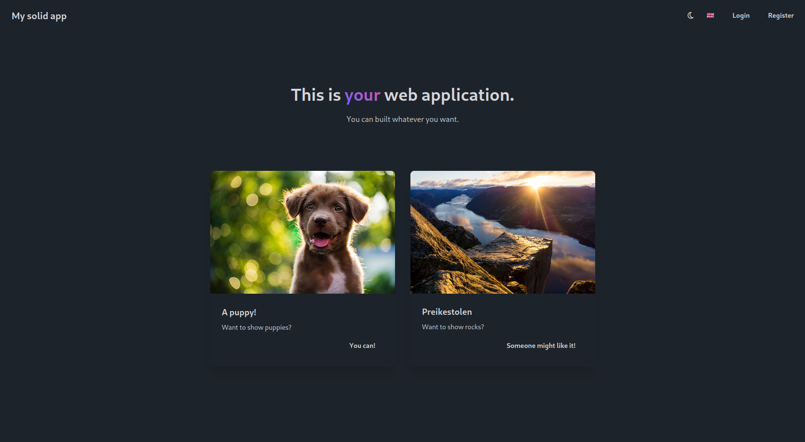
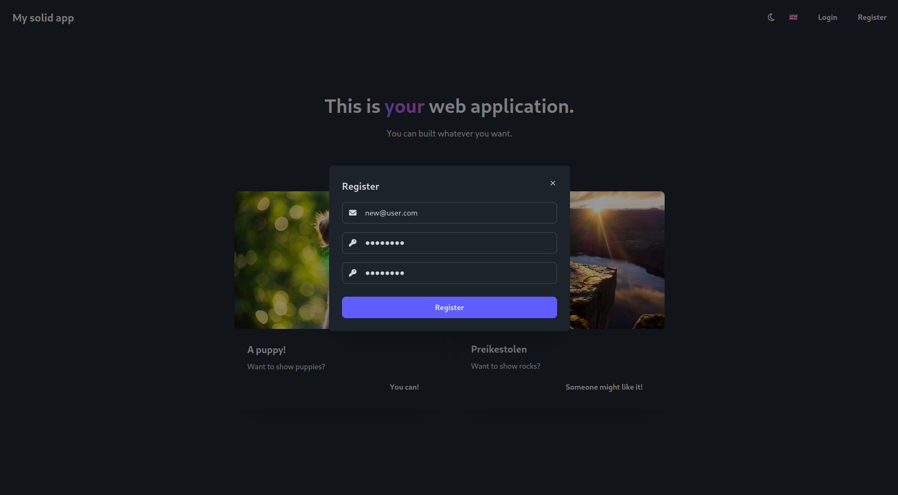
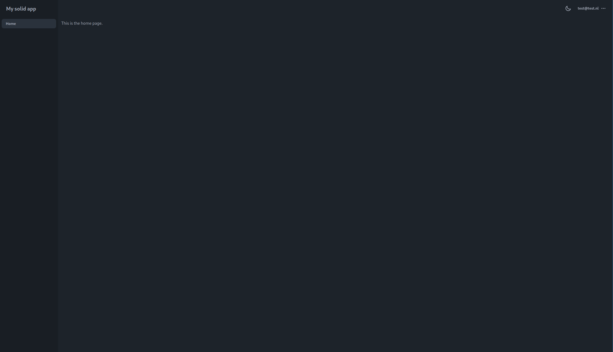

# Solid flask web app template
A full stack template for an app and web application with backend. The repository contains:
 - 🖥️ A frontend build in [Typescript](https://www.typescriptlang.org/) with [SolidJS](https://www.solidjs.com/) and [daisyui](https://daisyui.com/):
   - 🪪 Registering and logging in with user management
   - 🔑 2 Factor Authentication
   - 🔓 Password recovery with email
   - ✅ User email verification
   - 🌗 Dark theme support
   - 📜 Support for translations, and easily add your own language
   - 📝 Code formatting with [ESLint](https://eslint.org/) and [Prettier](https://prettier.io/)
 - 🗄️ A backend built in [Python](https://www.python.org/) with [Flask](https://flask.palletsprojects.com/en/3.0.x/) and [SQLAlchemy](https://www.sqlalchemy.org/):
   - 🧍 User login management with cookies using [Flask-Login](https://flask-login.readthedocs.io/en/latest/)
   - 💿 Database migrations using [Alembic](https://alembic.sqlalchemy.org/en/latest/)
   - 🧪 Tests with [pytest](https://docs.pytest.org/en/stable/)
   - 📝 Code formatting with [ruff](https://docs.astral.sh/ruff/)
 - 🚀 CI/CD with pipelines for:
   - 📝 Automatic linters for checking code format
   - 🧪 Running tests
   - 🐳 Building [Docker](https://www.docker.com/) containers
   - 💻 Automated single VPS deployment

## Landing page


## Register page


## Register page


## Installation
The template can be cloned into a new repository with the 'Use this template' button at the right top of this repository, or by using `git clone https://github.com/Swopper050/solid-flask-web-app-template.git`.

In order to run the project locally you need to:
  * [Install Node v20](https://nodejs.org/en/download/package-manager)
  * [Install pnpm](https://pnpm.io/installation)
  * [Install Python 3.12](https://www.python.org/downloads/)
  * [Install docker](https://docs.docker.com/engine/install/) together with [docker compose](https://docs.docker.com/compose/)

When you have all of this installed, setup all docker services:

```bash
cd solid-flask-web-app-template/
make docker_up
```

Setup the ui:
```bash
cd ui/
make deps
make server
```

Setup the api:
```bash
cd api/
python -m venv .env
make deps
make fixtures
make server
```

Now you can visit the local web application at http://localhost:5173


## Deployment
This project currently supports deployment onto a single VPS (frontend, backend and database all running on that VPS). For more information on how to do this, see the [deployment docs](docs/web_deployment.md).
