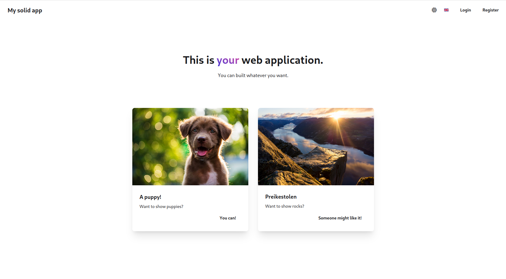
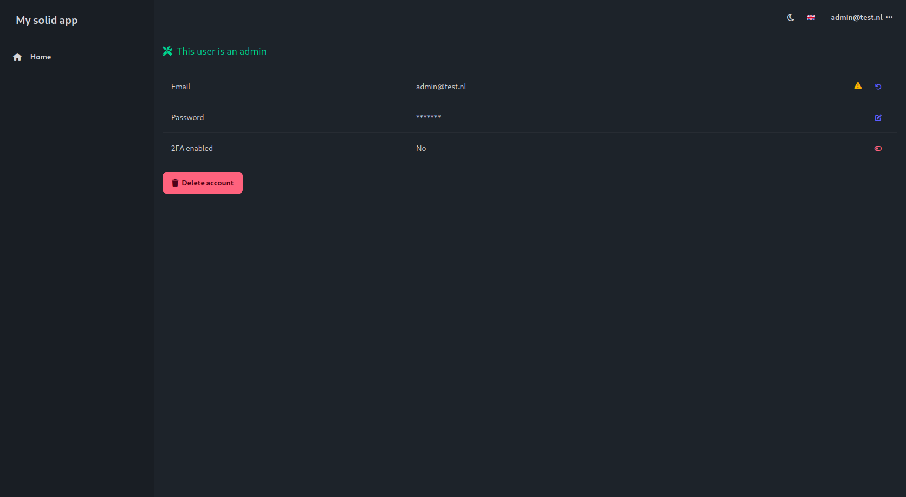
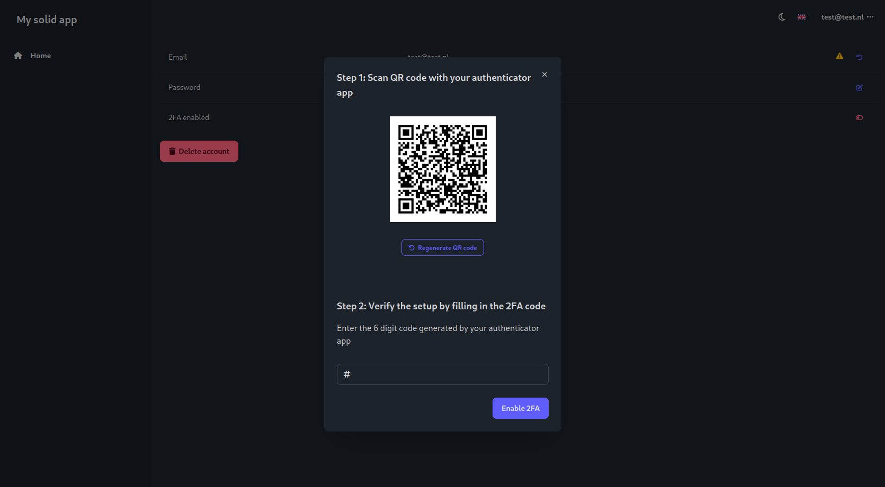
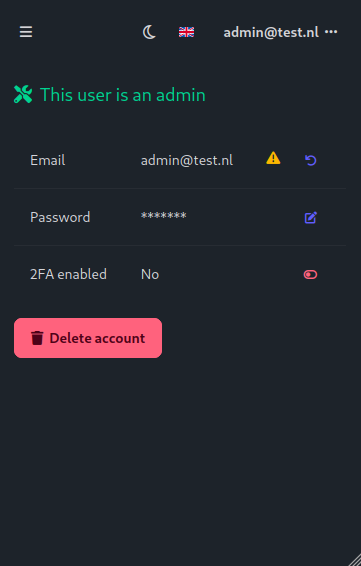

# Solid flask web app template

A full stack template for an app and web application with backend. The repository contains:

- 🖥️ A frontend build in [Typescript](https://www.typescriptlang.org/) with [SolidJS](https://www.solidjs.com/) and [daisyui](https://daisyui.com/):
  - 🪪 Registering and logging in with user management
  - 🔑 2 Factor Authentication
  - 🔓 Password recovery with email
  - ✅ User email verification
  - 🌗 Dark theme support
  - 📜 Support for translations, and easily add your own language
  - 🧱 Lots of out-of-the-box components to use
  - 📝 Code formatting with [ESLint](https://eslint.org/) and [Prettier](https://prettier.io/)
  - 🧪 Tests with [cypress](https://www.cypress.io/)
- 🗄️ A backend built in [Python](https://www.python.org/) with [Flask](https://flask.palletsprojects.com/en/3.0.x/) and [SQLAlchemy](https://www.sqlalchemy.org/):
  - 🧍 User login management with cookies using [Flask-Login](https://flask-login.readthedocs.io/en/latest/)
  - 💿 Database migrations using [Alembic](https://alembic.sqlalchemy.org/en/latest/)
  - 🧪 Tests with [pytest](https://docs.pytest.org/en/stable/)
  - 📝 Code formatting with [ruff](https://docs.astral.sh/ruff/)
- 🚀 CI/CD with pipelines for:
  - 📝 Automatic linters for checking code format
  - 🧪 Running tests
  - 🐳 Building [Docker](https://www.docker.com/) containers
  - 💻 Automated single VPS deployment
- 👷 Background tasks with built in [Python](https://www.python.org/) with [Celery](https://docs.celeryq.dev/en/stable/) and [Redis](https://redis.io/):
  - 📬 Send mails in the background
  - ⌛ Run slow tasks in a background process

## Landing page




## Register page


## Account page




## Admin page


## Responsive desing examples



## Installation

The template can be cloned into a new repository with the 'Use this template' button at the right top of this repository, or by using `git clone https://github.com/Swopper050/solid-flask-web-app-template.git`.

In order to run the project locally you need to:

- [Install Node v20](https://nodejs.org/en/download/package-manager)
- [Install pnpm](https://pnpm.io/installation)
- [Install Python 3.12](https://www.python.org/downloads/)
- [Install docker](https://docs.docker.com/engine/install/) together with [docker compose](https://docs.docker.com/compose/)

In order to replace all instances and variants of 'My solid app', 'MySolidApp', 'my-solid-app', 'my_solid_app', 'mysolidapp' and 'MY_SOLID_APP', run the following commands:

```bash
find . -type f -name "*" -not -path "ui/node_modules/*" -not -path "api/.env/*" -exec sed -i 's/My\ solid\ app/Your\ app/g' {} \;
find . -type f -name "*" -not -path "ui/node_modules/*" -not -path "api/.env/*" -exec sed -i 's/MySolidApp/YourApp/g' {} \;
find . -type f -name "*" -not -path "ui/node_modules/*" -not -path "api/.env/*" -exec sed -i 's/my-solid-app/your-app/g' {} \;
find . -type f -name "*" -not -path "ui/node_modules/*" -not -path "api/.env/*" -exec sed -i 's/my_solid_app/your_app/g' {} \;
find . -type f -name "*" -not -path "ui/node_modules/*" -not -path "api/.env/*" -exec sed -i 's/mysolidapp/yourapp/g' {} \;
find . -type f -name "*" -not -path "ui/node_modules/*" -not -path "api/.env/*" -exec sed -i 's/MY_SOLID_APP/YOUR_APP/g' {} \;
```

When you have all of this installed, setup all docker services:

```bash
cd solid-flask-web-app-template/  # Or your folder
make docker_up
```

Setup the ui:

```bash
cd ui/
make deps
make server
```

Setup the api:

```bash
cd api/
python -m venv .env
make deps
make fixtures
make server
```

Now you can visit the local web application at http://localhost:5173

## Deployment

This project currently supports deployment onto a single VPS, i.e. frontend, backend and database all running on that VPS, for both staging and production. For more information on how to do this, see the [deployment docs](docs/web_deployment.md).

You can visit the running staging and production version of this application at [https://my-solid-app.nl](https://my-solid-app.nl) and [https://staging.my-solid-app.nl:8443](https://staging.my-solid-app.nl:8443).
